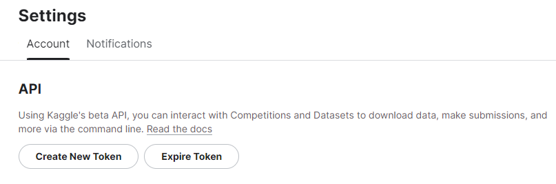
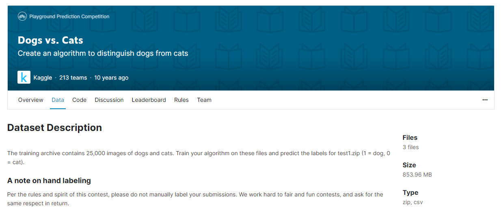
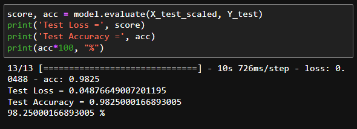

# Dogs vs Cats Image Classification

This repository contains a step-by-step guide and code for building an image classification model to differentiate between dogs and cats using TensorFlow and a pre-trained MobileNet model.

## Table of Contents

- [Project Overview](#project-overview)
- [Project Structure](#project-structure)
- [Getting Started](#getting-started)
- [Dataset](#dataset-used)
- [About the Code](#about-the-code)
- [Roadmap](#roadmap)
- [Contributing](#contributing)
- [Contact Me](#contact)
- [Resources](#resources-and-external-links)

## Project Overview

This project involves building an image classification model to distinguish between images of dogs and cats. The process includes data preprocessing, using a pre-trained model, training the model, evaluating its performance, and making predictions on new images. The project uses TensorFlow and a pre-trained MobileNet model, and the code is structured into modular files for better organization and maintainability.

## Project Structure

Describe the structure of your project directory here, including the main files, folders, and their purposes.

```
dogs-vs-cats-classification/
│
├── dataset/
│   ├── train/
│   ├── test/
|   ├── image resized/
│
├── resources
|   ├── OUTPUT.md
|   ├── screenshot1
|   ├── screenshot2
|   ├── ...
|
├── src/
|   ├── main.py
│   ├── preprocessing.py
│   ├── model.py
│   ├── train.py
│   ├── evaluate.py
│   ├── predict.py
│
├── AboutTheCode.md
├── GoogleCollab Example.pdf
├── Notebook Example.pdf
|
├── DogVsCatClassifier.ipynb
|
├── README.md
├── kaggle.json
├── requirements.txt

```

## Getting Started

### Installation

1. Clone this repository to your local machine:

```bash
git clone https://github.com/arindal1/Dogs-Vs-Cats-Classifier.git
```

2. Install the required packages using the [requirements.txt](requirements.txt)

3. Make a Kaggle account, and make a new API token for your profile. Put the downloaded `kaggle.json` file in the main directory.



### Note:

Don't use the Python files from [/src](/src). I started with it but switched to Jupyter Notebook later, so it has *dependency issues*. Stick to **Jupyter Notebook** or **Google Collab**.

## Dataset Used

We are using a Dogs vs Cats competition dataset from [Kaggle](https://www.kaggle.com/)



### The Asira Dataset

**Asirra** (Animal Species Image Recognition for Restricting Access) is a HIP that works by asking users to identify photographs of cats and dogs. This task is difficult for computers, but studies have shown that people can accomplish it quickly and accurately. 

[Dataset Link](https://www.kaggle.com/competitions/dogs-vs-cats)

### Note:

The dataset present in this repository, at [/dataset](/dataset) is just for demonstrative purposes. It has just a few images to serve as an example of how the dataset looks like, and the directory structure. The original data is really big, so it couldn't be included in this repo, use the original dataset using it API call:

`kaggle competitions download -c dogs-vs-cats`

You can also download it from [Resources](#resources-and-external-links) and use it manually.

## About the Code

To unberstand more about the code refer to [AboutTheCode](AboutTheCode.md)

## Accuracy

The accuracy of a machine learning model, including the MobileNetV2-based model we're working with, depends on various factors such as the quality and quantity of the training data, the model's architecture, the hyperparameters used during training, and the complexity of the problem being solved (in this case, classifying cats and dogs).



## Results

The results of the final **Predictive Model** can be found in [OUTPUT](resources/OUTPUT.md).

To test this model, you can use images from the `train` folder, or the `test` folder, or alternatively you can **download** images of cats and dogs from the *Internet* and use them to test the model's prediction.

## Roadmap

See the [open issues](https://github.com/arindal1/Dictionary-WebApp/issues) for a list of proposed features (and known issues).

## Contributing

Contributions are welcome! If you find any issues or have suggestions for improvements, feel free to create a pull request or open an issue.
Contributions are what make the open-source community an amazing place to learn, inspire, and create. Any contributions you make are **greatly appreciated**.

1. Fork the Project
2. Create your Feature Branch (`git checkout -b feature/AmazingFeature`)
3. Commit your Changes (`git commit -m 'Add some AmazingFeature'`)
4. Push to the Branch (`git push origin feature/AmazingFeature`)
5. Open a Pull Request

## Contact

If you have any questions or suggestions related to this project, you can reach out to me at:

- GitHub: [arindal1](https://github.com/arindal1)
- LinkedIn: [arindalchar](https://www.linkedin.com/in/arindalchar/)

## Resources and External Links

- The Kaggle Dataset used: [Dataset](https://www.kaggle.com/competitions/dogs-vs-cats)
- MobileNet v2: [Model](https://tfhub.dev/google/tf2-preview/mobilenet_v2/feature_vector/4)
- My Google Collab: [File](https://colab.research.google.com/drive/1eeuVHCfI963x5ehibpIO-x7uY4lw4bRG?usp=sharing)

**Note:** This is a personal project created for educational and demonstrative purposes. I made this project just for fun and learn more about Machine Learning in the process, and also record my progress in this field. With this repo I want to help others like me who are interested in Machine Learning projects.

---
### Happy learning and predicting! ❤️
